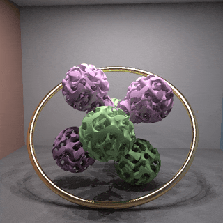

# ftrace — a spectral forward + backward photon raytracer

`ftrace` is a physically-based, **spectral** light-transport renderer written in
C++20. Unlike an RGB path tracer, it transports light one **wavelength** at a
time, so dispersion, chromatic aberration, thin-film iridescence, fluorescence
and diffraction all fall out of the physics for free — there is no special-casing
of colour. It has both a **forward** (light-tracing / photon) core and an
independent **backward** (path-traced) reference, a CUDA GPU backend for the
forward pinhole mode, and a small scene-description language (**FTSL**).

---

## Demo



*(320², 20 fps — [**the full-quality 480² 60 fps MP4**](pastel_jack_ring.mp4) is in
the repo. GitHub's Markdown strips `<video>` tags and serves repo `.mp4` as
`application/octet-stream` under `nosniff`, so an animated GIF is the only thing that
will actually play inline here.)*

*A gyroid-glass jumping jack tumbling inside a gold ring, 432 frames at 60 fps
(7.2 s, 480²), seamlessly looping. The ring's tilted plane precesses in the
**opposite** sense to the jack's own lean, because turning them the same way made
the two read as geared to one another rather than as independent motions.
Reproduce it with
`python tools/loom/examples/pastel_jack.py --render --name pastel_jack_ring`
([`tools/loom/examples/pastel_jack.py`](tools/loom/examples/pastel_jack.py); the
counter-rotation is that script's default `--ring-turns -3`), which renders every
frame at `-mode W -spp 8 -gi 24 -gi-clamp 0.15 -whitted-grid 3` and assembles the
MP4 and GIF.*

*The animation is authored in **[Loom](#loom--procedural-animation-toolkit)**, the
procedural toolkit bundled in `tools/loom/`, and there are no keyframes anywhere in it.
Every moving quantity — the jack's spin and its precession, its lean off the vertical,
the ring's spin and the tilt of the ring's plane — is a **modulator signal**: a pure
function of the loop phase, which is what makes the loop seamless by construction rather
than by matching the ends up. The geometry that has to stay *consistent* is then solved
from those signals instead of being animated alongside them — the ring's major radius is
derived from its tilt so that the bottom of the ring touches the floor and the top
reaches the top of the jack at **any** tilt, and the jack's standing height is derived
from its lean so its lowest ball stays on the floor as it leans over. Each of the five is
also exposed as a named channel — `jack_spin`, `jack_precess`, `jack_lean`, `ring_spin`,
`ring_tilt` — that loom's `CurveDrive` / `SceneDriver` layer can push at runtime, so the
same scene can be driven live (`python -m loom.anim examples/pastel_jack.py`) with those
invariants still holding. Loom discretizes **last**: only once a frame is asked for does
it collapse the whole graph to numbers and emit that frame's `.ftsl`, which ftrace then
renders — so the animation's source is the one Python file, not 432 baked scenes.*

> **This clip was rendered by a _backward_ tracer, not the forward one.** Mode `W`
> is the deterministic Whitted preview, which is mode `R`'s **backward** camera-ray
> walk with every Monte-Carlo draw replaced by a fixed quadrature — rays start at the
> camera and are traced toward the lights, the opposite of the forward photon core
> the project is named for. It was the right tool here for a reason that is worth
> stating plainly: an animation needs every frame to be *quiet*, and a forward mode
> reaches that only by converging away its noise, frame after frame. A deterministic
> mode has no noise to converge, so each frame is final in seconds and — crucially —
> consecutive frames carry no independently-drawn grain to shimmer against each other.
> The trade is that mode `W`'s global illumination is a one-bounce `-gi` gather rather
> than the real multi-bounce transport modes `A`/`B`/`C`/`M`/`S`/`U` deliver. So take
> this as a demonstration of the geometry, materials and animation tooling, **not** as
> a showcase of the forward light-transport engine or of ftrace's spectral caustics —
> for those see the [mode table](REFERENCE.md#render-modes--mode-or-per-camera-mode)
> and the gallery scenes.


*A quarter-million individual hairs, and not one of them is authored.
[`scenes/fur_creature.ftsl`](scenes/fur_creature.ftsl) is eighteen spheres — fifteen for
the body, three for the eyes and nose — and fifteen `fur { }` blocks for the coat, and
that is the whole model. The generator turns each block into strands at load time and
emits them as ordinary curve primitives, so the tracer, the BVH and the CUDA backend
never learn that fur exists. Reproduce it with
`ftrace -in scenes/fur_creature.ftsl -mode D -noise 2 -r 720 540 -o png/fur_creature_gi.png -window`
(720×540, bidirectional path tracing to a 2 % noise target).*

*What makes it read as an animal rather than as a hedgehog of line segments is that
every strand is **slightly wrong** in its own way — length, lift, droop and comb all
carry per-strand jitter, and neighbouring strands are pulled toward shared guide hairs
by `clump`, which is what produces the wisps and partings a uniform coat never has. The
lighting does the other half: fur is mostly gaps, so the strands are lit far more by
light that has already bounced off the floor and the walls than by anything direct,
which is why this is a global-illumination render and why the underside of the belly
still has colour in it.*

*The eyes are a good illustration of why the generator has the parameters it does. They
are separate little spheres sitting **on** the head, and the head's own coat is rooted
uniformly over the whole head — including the ring of skin each eye overlaps — so the
first render came back with both eyes peppered with hair growing straight across them.
Making the eyes stand proud of the coat does not fix that; it only stops them being
buried. The fix is [`bald`](FTSL.md#87-fur--scatter-strands-over-a-surface), which names
a sphere the groom must keep out of and culls — after clumping, and testing the **whole
strand** rather than just its root — every hair that reaches into it.*

*The same animal also stands in the gallery. [`scenes/gallery_rain.ftsl`](scenes/gallery_rain.ftsl)
gives it the eleventh plinth and routes the closed camera fly-through **into its coat** — the
loop threads five pieces now, and this is the only one that is neither a hole, a bore nor a
transparent volume. The camera spends 1.16 m inside the fur travelling nose-to-tail (with the
comb, not against it) at 21 mm a frame, the slowest movement anywhere on the flight, passing
12.8 mm clear of the skull. At that range the strands are 0.64 mm thick and cross the whole
frame, so the coat stops being a texture and becomes architecture — which is the entire
argument for standing a groom in a hall of polished objects.*

---

## Highlights

- **Spectral transport** — continuous per-photon wavelengths over a configurable band
  (e.g. `spectral 360 830 1`); per-wavelength refraction gives dispersion and
  chromatic aberration with no extra code. On the **CPU** tracers (`A/B/C`, `R`, `M/S`,
  BDPT `D` and VCM `U`) *and* the **GPU
  megakernel** (forward `A/B/C` + `M`, the backward reference `R`, and BDPT `D`) they use
  **hero-wavelength sampling** (4 stratified λ share one BVH walk, cutting colour
  noise ~0.77×), collapsing to a **single continuous λ** the moment dispersion
  matters — so dispersive **caustics** (light focused through a prism, a lens, or a
  glass of water) still split into true spectral colour instead of smearing an
  averaged RGB, for more physically realistic focusing. (`-heroc 1` reverts to one
  λ per photon, bit-identically.)
- **Forward *and* backward** engines that validate each other (mode `V` reports
  the residual between them).
- **Realistic cameras** — from a simple pinhole to a **physical multi-element
  lens** (real glass prescription: depth of field, vignetting, spherical &
  chromatic aberration all emergent), plus fisheye/panoramic projections.
- **Rich material set** — dielectrics with real glass dispersion, metals from
  measured data, rough microfacet, thin-film & multilayer interference,
  diffraction gratings, fluorescence, and stochastic mixes.
- **Wave-optical effects** — thin-film Airy interference, Abelès multilayer
  stacks, and reflective diffraction gratings.
- **Curve / fiber primitive** — `curve` strands for hair, fur, grass, wire and
  thread, in four bases (`linear`, `catmull_rom`, `bezier`, `bspline`), traced as
  chains of **round cones** that share their end spheres, so a strand is one
  watertight surface with no cracks at the joints — a handful of segments per hair
  instead of the ~64 triangles a ribbon would need. Ray-traced on **CPU and GPU**
  (74× measured on a 96 000-segment fur patch), and shown by the raster preview.
- **Fur / groom generator** — `fur { on "<object>" … }` scatters 10⁴–10⁶ strands
  **area-uniformly** over any named sphere, mesh, quad or triangle and shapes them with
  lift, comb, gravity droop, curl and Voronoi clumping. It emits ordinary `curve`
  records, so a groom needs no new code anywhere downstream and inherits the GPU path
  for free; the build is a deterministic, lock-free pure function of
  `(surface, parameters, seed)`.
- **Participating media** — one or many coexisting (superposed) fog regions with
  Henyey–Greenstein or Rayleigh scattering; box / sphere / **named-object** bounds
  (fog shaped to a sphere, isosurface field, or mesh AABB) and heterogeneous
  **density fields** — either formula-defined blobs with soft edges *or* imported
  **OpenVDB `.vdb` / NanoVDB `.nvdb` volumes** (`density vdb:<file>`, read by a
  built-in reader that dispatches on the file magic) — via unbiased delta/ratio
  tracking on the forward modes (CPU and GPU) **and the backward reference (mode
  `R`) on both CPU and GPU** (GPU backward runs homogeneous *and* heterogeneous
  media natively, including spectral **rainbow-phase** media, and **gradient-index
  (GRIN) media** on the backward reference now run on GPU too).
- **Volumetric blackbody emission ("fire")** — a medium with a `temperature vdb:`
  grid + `emission blackbody` turns its hot voxels into a self-illuminating,
  isotropic **volume emitter**: the flame glows (Planckian, temperature-hue-shifted)
  and lights the rest of the scene with **no external light**. Multi-grid `.vdb`
  files (the official OpenVDB *fire* sample's `density` + `temperature` grids) are
  selected **by grid name**; `emission_kelvin`/`emission_scale` tune the colour
  temperature and glow. Runs on both the **CPU and GPU** forward tracers (modes
  A/B/C, V/P forward layers); the per-photon wavelength is importance-sampled from a
  Planck blackbody so the flame colour converges cleanly.
- **Gradient-index (GRIN) media** — a bounded region carrying an `ior "n(x,y,z)"`
  field bends rays continuously along the Eikonal ray equation (mirages, gradient
  lenses, hot-air shimmer) via a shared symplectic marcher. Works on the forward
  light tracer (modes `A`/`B`/`C`, CPU **and GPU**) and the backward reference
  (mode `R`, CPU **and GPU** — the device runs the same Eikonal marcher, matching
  the CPU to the device float-precision envelope); BDPT (`D`) refuses GRIN scenes
  (its straight-line connection geometry would be biased — use `A`/`B`/`C` or `R`).
- **CUDA GPU backend** for the forward pinhole splat (mode `B`), the backward and
  BDPT references (`R`/`D`), the **view-independent photon map** (`M`, shared
  across a whole camera flythrough), **stochastic progressive photon mapping**
  (`S`, a resident per-pixel SPPM session), and **VCM/UPS** (`U`, a resident
  vertex connection + merging session), megakernel or wavefront, with CPU fallback.
- **Whole camera flybys in one render** — some modes amortise a *single* light
  transport pass across an entire moving-camera shot. The **view-independent photon
  map** (mode `M`) is built **once** from one forward photon pass, then reused to
  gather every frame of a camera flythrough (or every camera of a multi-camera
  render), so an *N*-frame flyby costs roughly one render's worth of photons instead
  of *N* — far more efficient than re-tracing the scene per frame.
- **Decorrelated volumetric flybys (`-beams`, photon beams)** — the shared forward
  mode-`B` pass normally splats one photon realisation to every camera, so a rainbow /
  fogbow / glory (view-dependent **single** scattering) comes out with the *same*
  frozen speckle welded into every frame of a flyby. Adding **`-beams`** (alias
  `-photonbeams`) switches to a single-scattering **long-beam** estimator: the photon
  crosses the medium straight (deposited once), and **each camera independently draws
  its own in-scatter point** toward its own eye. Result: the *same* mean bow with
  **independent per-frame noise** — the "fast AND best" combination (≈1× photon cost
  across the flyby, correct per-view angle, clean non-frozen grain). It deliberately
  drops the multiple-scatter haze wash, so the bow is actually *crisper* than the
  shared baseline. Runs on **both CPU and GPU** (the per-camera in-scatter resample is
  ported to the CUDA forward tracer, and spectral-rainbow-phase media now run on the GPU
  too — the λ×µ Airy phase table is uploaded per-medium). Rainbows/fogbows/glories are
  single scatter, so this loses nothing that matters for them.
- **Interactive flypath viewer & editor** — the live `-window` viewer doubles as a
  **camera-curve editor**: author a real `camera_curve` flypath *by flying it* —
  record / insert / delete / steer control points, paint per-point speed and look
  direction, round-trip and revise an existing curve, then save a ready-to-render
  `camera_curve { … }` block. See [Camera animation](REFERENCE.md#camera-animation-camera_path-camera_orbit).
- **Long-running renders** — time / noise / forever budgets, live ANSI preview,
  and checkpoint/resume.
- **Loom animation toolkit** — a bundled Python toolkit for building scenes and
  seamless looping animations that emit `.ftsl` per frame (procedural ribbons/tubes,
  N-D-transformed isosurfaces, motion graphics, and more). See
  [`tools/loom/`](tools/loom/README.md).

---

## Building

Requires a C++20 compiler and CMake. CUDA is **optional** (auto-detected).

```sh
cmake -B build -S .
cmake --build build --config Release --target ftrace
```

The binary lands at `build/bin/ftrace` (`.exe` on Windows).

> **Windows + CUDA gotcha.** With the Visual Studio generator, CUDA auto-detection
> needs the CUDA **VS integration** (MSBuild props), not just `nvcc` on `PATH`. If
> configure prints `CUDA not found; building CPU-only`, point the toolset at the CUDA
> install directly and select the VS instance that has the integration, e.g.:
> ```sh
> cmake -B build -S . -G "Visual Studio 17 2022" -A x64 \
>   -T "cuda=C:/Program Files/NVIDIA GPU Computing Toolkit/CUDA/v13.3" \
>   -DCMAKE_GENERATOR_INSTANCE="C:/Program Files/Microsoft Visual Studio/2022/Community"
> ```
> A CUDA-linked `ftrace.exe` is ~3 MB vs ~0.8 MB for a CPU-only build — a quick size
> check tells you which you got.

Useful CMake options:

| Option | Meaning |
|---|---|
| *(CUDA auto-detected)* | If a CUDA toolkit is found, the GPU backend (`src/render_cuda.cu`) is compiled and `-device gpu` becomes available; otherwise a CPU-only binary is built. |
| `-DFTRACE_CUDA_ARCH=native\|all-major\|"75;86;89"` | GPU architectures to target (default `native`). |
| `-DFTRACE_GPU_FP32=ON\|OFF` | GPU transport in float with double film accumulation (default `ON`); `OFF` = full FP64 (slower, CPU-matching). |

---

## Quick start

```sh
# List the common flags, grouped by task, and exit
ftrace -h            # or --help

# Which build is this? (the repo's VERSION, baked in at compile time)
ftrace -version      # or --version / -V   ->  "ftrace 0.141.0"

# Built-in Cornell box, forward pinhole splat (mode B), 512²
ftrace -scene cornell -n 200000000 -r 512 -o cornell.png

# Render an FTSL scene file
ftrace -in scenes/cornell.ftsl -n 200000000 -o out.png

# Quick-view a bare mesh — auto-lit, auto-framed, live raster preview window
ftrace cloud1.glb            # also .obj/.gltf/.fbx/.stl/.ply; drag-drop / double-click works

# Physical-lens camera demo (depth of field from real optics; forces mode R)
ftrace -in scenes/realcam.ftsl -n 6000000 -o realcam.png

# Render until a wall-clock budget with a live preview
ftrace -in scenes/group.ftsl -time 120 -preview -o group.png
```

Run `ftrace -h` (or `--help`) for a grouped summary of the common flags. An
unrecognized `-flag` (e.g. a typo) is a hard error — ftrace prints
`unknown option '…'` and exits non-zero rather than silently falling back to the
default demo render. Likewise a bare positional argument that looks like a file
but isn't a recognized scene or mesh (e.g. `ftrace foo.xyz`) is a hard error, not
a silent fall-through to the demo scene.

The scene file gets the same treatment, one step softer. The loader tracks which
properties a builder actually read, and reports the ones nobody looked at:

```
[ftsl] warning: myscene.ftsl: sphere: unknown key 'priority' on line 42
```

That's a warning rather than an error, so an older scene carrying a stale property
still renders — but it's worth fixing, because an unread property does *nothing*. A
typo, a property written on the wrong block (`priority` is a **material** slot, not a
geometry one), or a scene generator that has drifted from the grammar would otherwise
quietly produce a **wrong image** instead of a complaint. See FTSL.md §1.3.

> **Quick mesh viewer.** A bare positional **mesh** path — `ftrace model.glb`
> (also `.obj` / `.gltf` / `.fbx` / `.stl` / `.ply`) — wraps the mesh in a
> synthesized, auto-lit scene (a neutral clay fallback material under a soft uniform
> environment; glTF/GLB primitives keep their own imported materials) and opens it in
> an **auto-framed live raster preview window** — the same interactive fly-camera as a
> double-clicked `.ftsl`. The camera is aimed at the mesh's bounding sphere from a
> three-quarter front-high angle and pulled back so the whole model fits the frame, so
> you never have to hand-place a camera just to look at a model. Presentation flags
> (`-window`, `-o`, `-r`, `-camera`, `-view`) keep it a preview; to render the same
> auto-lit scene with real light transport instead, pass a transport flag —
> `ftrace model.glb -mode D -n 100000000 -o png/model.png`.

---

## Where the rest of the documentation lives

Everything that used to sit inline below this point — nine hundred lines on the
render modes alone — now lives in [**`REFERENCE.md`**](REFERENCE.md), so this page
stays something you can actually read end to end.

| Looking for | Go to |
|---|---|
| What each `-mode` letter does, which light paths it can capture, how fast it is, and which run on the GPU | [Render modes](REFERENCE.md#render-modes--mode-or-per-camera-mode) |
| Pinhole / thin-lens / physical multi-element lens, fisheye and panoramic projections, camera paths and flybys | [Cameras](REFERENCE.md#cameras) |
| Dielectrics, metals, microfacet roughness, thin-film and multilayer interference, gratings, fluorescence, mixes | [Materials](REFERENCE.md#materials) |
| Building SPDs — blackbody, gaussian, measured tables, `rgb` upsampling, IOR curves, the named presets | [Spectra](REFERENCE.md#spectra-spds-reflectances-indices) |
| Area / sphere / cylinder / spot / sun / environment emitters and how they're sampled | [Lights](REFERENCE.md#lights) |
| Primitives, transforms, meshes (`.obj` / `.gltf` / `.glb` / `.fbx` / `.stl` / `.ply` / `.ftmesh`), CSG, isosurfaces | [Geometry](REFERENCE.md#geometry) |
| Hair / fur / grass / wire strands — the `curve` primitive and its four bases | [Curves and fibers](REFERENCE.md#curves-and-fibers-curve) |
| Image textures, UV handling, and the math-driven procedural patterns | [Textures](REFERENCE.md#textures) · [Patterns](REFERENCE.md#procedural-patterns-math-driven-materials) |
| Fog and volumes: homogeneous, bounded, heterogeneous density fields, OpenVDB / NanoVDB import | [Participating media](REFERENCE.md#participating-media--fog) |
| A tour of the scene language, and stereoscopic / animation workflows | [Scene language](REFERENCE.md#scene-language-ftsl) |
| Every command-line flag | [Command-line reference](REFERENCE.md#command-line-reference) |
| Output formats, `.ftbuf` checkpoints, resuming, tone mapping | [Output](REFERENCE.md#output) |

Beyond that: [**`FTSL.md`**](FTSL.md) is the authoritative scene-language grammar
(the reference's tour is deliberately not a spec), [**`tools/loom/README.md`**](tools/loom/README.md)
documents the Python animation toolkit, and [**`known-issues.md`**](known-issues.md)
tracks open bugs and technical debt.

---

## Loom — procedural animation toolkit

The repo bundles **Loom** (`tools/loom/`), a programmatic-first Python toolkit for
building 3-D scenes and **seamless looping animations** that render on ftrace. Loom
animates *continuous* things — modulator graphs, curves, fields, N-D-transformed
isosurfaces — and discretizes **last, per frame**, emitting one `.ftsl` per frame
which ftrace then renders (raster preview or full path trace) and assembles into a
GIF/MP4. It ships with ready-to-run examples (swept ribbons/tubes, native `curve` fiber
tangles, gyroid and other triply-periodic minimal-surface loops, higher-dimensional
gyroid slices, function-driven materials, 2-D motion graphics, spacetime-transform
videos) and stands alone (it can drive any renderer).

**The [demo at the top of this page](#demo) is a loom animation** —
[`tools/loom/examples/pastel_jack.py`](tools/loom/examples/pastel_jack.py) — and it is
the worked end-to-end example of loom's driven-channel path: every moving quantity is a
modulator signal of the loop phase, the dependent geometry is *solved* from those signals
so contact and framing invariants hold at any value, and the five authored quantities are
published as named `Slot` channels a `CurveDrive` can push live. Start there if you want
to see the whole stack in one file.

See **[`tools/loom/README.md`](tools/loom/README.md)** for the tour, and
`tools/loom/DESIGN.md` for the architecture.

**Native viewer (`-viewer`).** ftrace doubles as loom's native scene viewer:
`ftrace -viewer <scene.viewer.json>` opens a Dear ImGui / Direct3D 11 window on a loom
**scene-introspection sidecar** (written by `loom.viewer.ViewerModel.save_sidecar`). It
shows the scene's objects, datasets, camera/lights and modulator-DAG summary, and draws
each curve dataset in a full **N-D curve pane** — a structural view of the Python model with
no browser/WebGL round-trip. The pane orbits (drag) and zooms (wheel), picks **any 3 of the
curve's N dimensions** to map to screen X/Y/Z (view-only re-projection), marks progression
with **index markers** along the curve, and supports **stereoscopic viewing** — red-cyan
anaglyph and wall-eyed / cross-eyed side-by-side, with an eye-separation slider. Below the
3-D pane sit **scroll-locked strip charts** (ImPlot) — one per curve dimension and one per
tacked-on `TrackedPath` channel; they share a linked X axis (paging scrolls them all
together) and a draggable index line wired to the 3-D index dot. A **Modulator DAG**
panel (imnodes) lays out the scene's signal graph — each node titled `<op> #<id>` with
one labelled input pin per incoming edge (the parameter that upstream node feeds), leaves
on the left and the params they drive on the right. An **axis-typed** modulator
(loom's `loom.axes` layer) additionally shows its **free axes** (`axes {s,t}`; `{}` for a
constant, which broadcasts everywhere) and a one-line caption naming what kind of node it
is in that model — a target's declared quantity (`gain target (neutral 1)`), the axis a
reduction consumes (`reduce s (mean, 8 samples)`), or a value-site's axis scope
(`t from clock, {s} pinned <- {s,t}`) — while an **influence edge** into a target reads
`mod[0] x0.8` / `pin[1] x0.25` on its input pin, so you can see the pin/mod combine model
rather than just the call graph. (This needs a **v2** sidecar; a v1 one renders as before.)
The pane sizes itself to whatever height is left in the side column and **wraps each layer
into sub-columns** so a graph with dozens of leaves stays inside the visible area instead of
running off the bottom; the wrap uses the node boxes imnodes actually produced, so nothing
overlaps at any DPI. Because imnodes has no zoom of its own, the panel implements a real one
by scaling the font and node padding: **wheel to zoom** (15–300%), **fit** solves for the
zoom that shows the whole graph, **100%** resets it, **re-layout** redoes the layering, and
**maximize** throws the graph full-window (auto-fits on entry, re-fits when the window
resizes, **Esc** to dock it again).
A **Fields tab** renders `Grid` and
`Scatter` datasets: their sample points appear in the same 3-D orbit view (grid node
positions reconstructed from the fixed lattice), coloured either by a **heatmap of a
selectable channel** or by **channels 0/1/2 → RGB**; **click any point to inspect** its
position and every channel value, and for N-D grids **per-extra-dim slice sliders** collapse
the dims you're not viewing to a chosen lattice index. A **Meshes tab** draws `SweptMesh`
surfaces (tubes, ribbons, blobs) as a **shaded, GPU z-buffered triangle mesh** — flat two-sided
lambert lighting, an optional depth-tested wireframe overlay, and grey / per-object-tint /
UV-checker / **texture** colouring; orbiting spins the existing tessellation (view-only) and is
free, since the geometry is uploaded once and re-uploaded only when the tessellation itself
changes. Being a real depth buffer, **interpenetrating surfaces** — a swept tube threading an
isosurface, two crossing tubes — come out right instead of being ordered a whole triangle at a
time. In **texture**
mode (the default) each mesh wears its **real skin**, sampled at the interpolated per-vertex
UVs: an image texture is decoded with ftrace's own loader (paths resolve relative to the
sidecar), and a procedural `r`/`g`/`b` formula skin is baked on the CPU through ftrace's own
pattern VM — including `tex:<name>(u,v)` sampling of an image declared above it — so the
preview matches what the renderer would produce. A mesh with no skin, or a skin that fails to
load or compile, falls back to grey and the reason is printed under the pane. `IsoMesh`
isosurfaces are baked to a marching-cubes mesh and shown in the same Meshes tab, and a `Strand`
fiber — which ships no triangles at all, since ftrace's native `curve` primitive flattens itself
into round cones at load — is **tubed** for the preview from its centreline and per-sample
radius, swept along a rotation-minimising frame so a closed loop's tube closes without a twisted
band at the seam. When the sidecar carries a
`source` key — the `.ftsl` `save_sidecar` emits beside it — a **Render tab** raymarches the
*real* isosurface **field** in-process: it parses the `.ftsl` with ftrace's own `ftsl::load`
and sphere-traces the field bytecode via `renderIsoPreviewCuda` (the `-raster-gpu` preview
kernel — no tessellation), driven by an orbit camera (drag to rotate, wheel to dolly) with
resolution and FOV controls, blitting each converged frame into a D3D11 texture. This is the
actual field rather than the static marching-cubes mesh.

**Live re-derivation (`-loom <scene.py>`).** Everything above reads a sidecar that was
frozen when loom wrote it, so orbiting can only re-project geometry that already exists.
Add `-loom <scene.py>` (or open a sidecar that carries a `build` provenance key) and the
viewer keeps a **loom process alive alongside itself** — `python -m loom.viewer <scene.py>`
over a newline-delimited-JSON channel — so it can *re-derive* the scene instead of merely
re-viewing it. A **Live (loom)** section in the left column shows the link state, a
`frame`/`frames` clock scrub, and one control per keyword parameter the scene's
`build(clock=None, **params)` declares — float and int drags, checkboxes, string labels —
typed from the values loom reports. Moving any of them re-runs `build()`, re-emits the
`.ftsl` plus its mesh assets, and the Curves / Fields / Meshes / Render panes all adopt the
new geometry on whatever frame it lands, keeping your orbit, zoom, tab and DAG layout.
Pick one continuous parameter as the **sweep axis** (the radio button beside it) and
**right-dragging any 3-D pane rotates into that dimension** — the gesture the static viewer
could never offer, since the extra dimension isn't in the sidecar until someone bakes it.
Bakes run on a worker thread and are **latest-wins**: a job that hasn't started yet is
overwritten, so a fast drag costs one bake of wherever you end up rather than one per
intermediate frame, and the UI never blocks on loom. The panel's `posted / baked` counters
make that visible (`posted > baked` is the collapsing working), alongside the last bake's
sequence number and wall time. `auto` off defers bakes to the **re-derive now** button for
scenes too slow to rebuild interactively; a scene that raises, or emits an `.ftsl` ftrace
can't load, reports the error in the panel and leaves the last good geometry on screen.

The clock **plays**, not only scrubs: a **play/pause** button (or the **spacebar**), a `|<`
rewind, **loop** and **ping-pong** toggles, and **left/right arrows** to step one frame.
Playback is *paced by the bake*, not by a wall-clock timer — the clock advances only when a
re-derivation lands. That is deliberate: the queue is latest-wins, so a play loop posting on
a timer would have most of its frames superseded before they ran and would show a stutter of
whichever ones won the slot rather than the animation. Pacing to the bake plays every frame,
and the readout states the **measured** rate ("playing 1.7 fps") rather than pretending to a
frame rate it isn't hitting. Play needs somewhere to advance to, so it is disabled when
`frames` is 1 — which is what a sidecar saved without a clock advertises; save with
`ViewerModel.save_sidecar(path, Clock.at_frame(0, N))`. Adding **`-play`** opens with the
transport already running, so a loop can be watched — or its per-frame cost read off the
`[play]` trace on stdout — without anyone having to click into the window first.

The Live panel breaks the played frame down into its parts (`bake`, `sidecar`, `ftsl`,
`raymarch`, and an explicit `other` residual so the numbers account for the whole period),
so you can see where a slow frame actually goes rather than guessing. `raymarch` is broken
down further into `upload + kernel + readback`, because those scale with different things —
scene size, pixels and pixels respectively — and only `kernel` runs on the GPU's shaders.
That distinction matters: **another process using the GPU inflates `kernel` and nothing
else**, so a breakdown taken on a busy card will overstate the raymarch and understate
everything else. Check with `tools/gpu_by_process.ps1` before drawing conclusions
(`nvidia-smi` cannot attribute utilisation per process under Windows' WDDM driver model).

Measured on an idle card, a played frame is dominated by the loom round-trip — emitting the
scene and adopting it each frame — with the whole raymarch under 10 %. Successive rounds of
profiling that round-trip have taken playback from **4.61 to 9.75 fps**; the largest single
step was getting geometry **out of the filesystem altogether**. The mesh and the sidecar now
travel over the stdio pipe the two processes already share, rather than through temp files —
which not only skips the I/O but sidesteps the on-access virus scan those freshly-written
files attracted, and that scan was costing more per frame than the entire GPU kernel. As of
this version a played frame writes **nothing to disk at all**, and loom's own tessellation is
what's left as the dominant term. Scenes that *do* load assets from disk get a related
speedup: their files are prefetched on a background thread while the `.ftsl` is being parsed,
which is worth up to ~20 % on a mesh-heavy scene's first load and costs nothing when the
files are already warm. The Render pane's **`play res`** slider renders at a reduced draft
resolution *only while the transport is playing*, snapping back to full resolution the moment
you pause, which buys back the part of the cost that does scale with pixels. See
`known-issues.md` for the full breakdown — including a worked example of a benchmark that
confidently reported one of these optimizations as a regression.

Five rounds of that made the round-trip cheaper. **Prebake** removes it. Hit **prebake** in
the Live panel (or launch with `-prebake`) and the viewer walks the clock once, keeping every
frame's *adopted* state — geometry, scene, DAG, skins — in memory; playback then costs
**0.01 ms a frame** and runs on a real wall clock at whatever `fps` you ask for, instead of at
whatever loom can bake. Scrubbing the frame slider becomes instant for the same reason. A
progress bar and a live MB readout run during the walk, and a **cap MB** budget stops it
before it eats the machine: a cache that hits the cap still plays the prefix it filled from
memory and falls back to bake-paced play for the rest, so a long clock degrades rather than
failing. The cache is dropped whenever a parameter or `frames` changes, because a cache built
at other values is not a cache of what you're looking at. Measured on `scatter_modulated_sweep`
(96 frames, 603 MB): a requested 24 fps is *delivered*, against 6.5 fps for the same scene
uncached — and the only real per-frame cost left is the Render tab's raymarch, which you can
stop paying by switching tabs.

---

## Known issues & roadmap

Open limitations and technical debt are tracked in `known-issues.md` — including
the physical-lens camera's remaining gaps (inter-element flare/ghosting,
shaped-iris bokeh).
